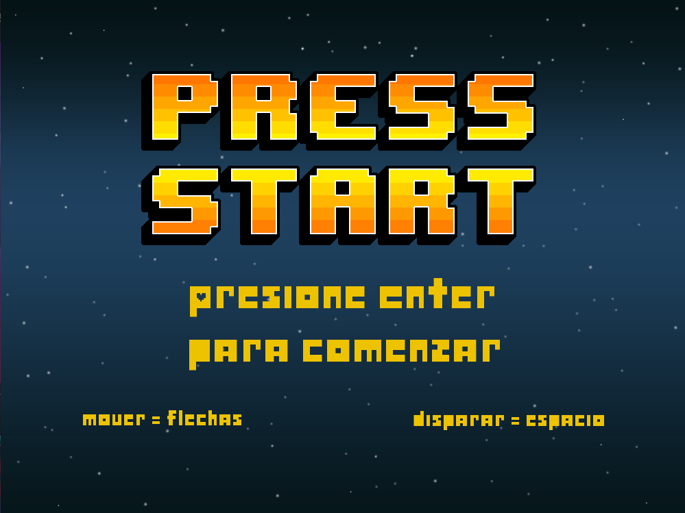
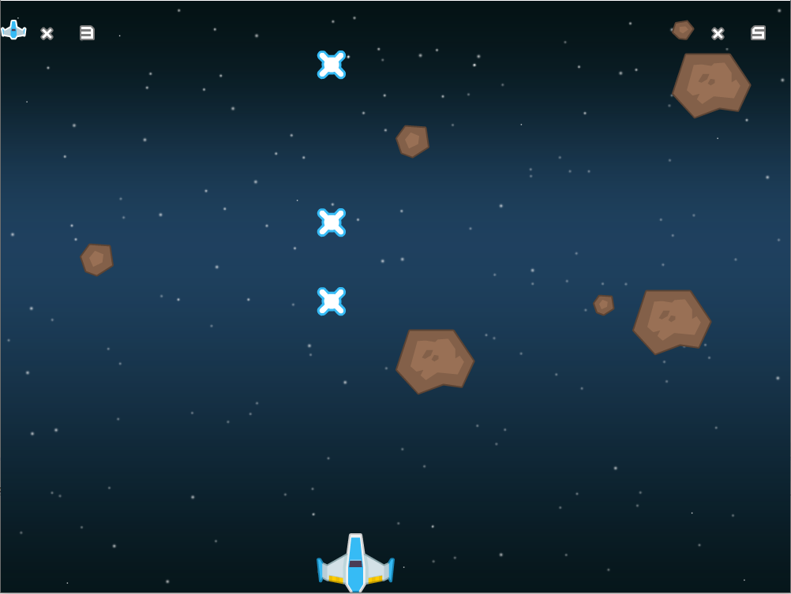
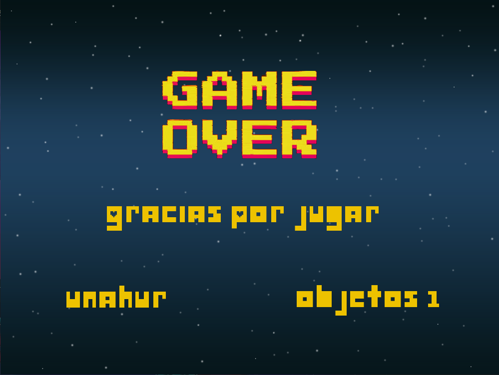

# Space Shooter 

## Equipo de desarrollo

- Matias Daniel Diaz - matiasdiaz142
- Matías Calderón - matiasnchur
- Santiago Diaz Noia - Sadino07
- Sebastián Addur - SebaAddurUnahur
- Mariana Alpern - AlpernMariana

## Capturas
Pantalla de Inicio.

Pantalla del Juego.

Pantalla de Fin del Juego.

## Reglas de Juego / Instrucciones
El jugador manejará una nave espacial con el que tiene que destruir los meteoritos. La nave se mueve con las flechas direccionales del teclado y dispara con el espacio.
El juego finaliza si perdes todas las vidas (perdes una vida cuando chocas con un meteorito) o cuando destruis 5 meteoritos.
Mover : Flechas
Disparar : Barra de espacio

## Otros

- Universidad Nacional de Hurlingham
- Programación de objetos I / Comisión 1B
- Versión de wollok (ni idea)
- Una vez terminado, no tenemos problemas en que el repositorio sea público.
